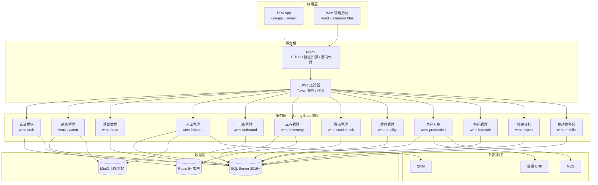

# WMS 仓储管理系统 — 开发设计文档

> **版本**: V1.0  
> **日期**: 2026-06-25  
> **依据文档**: WMS需求规格说明书 V1.0、WMS_API接口文档 V1.0、WMS项目概览  
> **Base URL**: `http://{host}:8080/api/v1`

---

## 目录

1. [三份源文档分析](#1-三份源文档分析)
2. [统一技术方案](#2-统一技术方案)
3. [系统架构](#3-系统架构)
4. [模块划分与依赖关系](#4-模块划分与依赖关系)
5. [数据流设计](#5-数据流设计)
6. [接口定义汇总](#6-接口定义汇总)
7. [数据库与核心模型](#7-数据库与核心模型)
8. [技术选型理由](#8-技术选型理由)
9. [关键实现要点](#9-关键实现要点)
10. [开发优先级排序](#10-开发优先级排序)
11. [项目结构与交付物](#11-项目结构与交付物)

---

## 1. 三份源文档分析

### 1.1 WMS项目概览 — 核心内容

| 维度 | 内容 |
|------|------|
| **定位** | 项目架构与模块的可视化总览，面向管理层与开发团队快速对齐 |
| **架构分层** | 终端层（PDA + Web）→ 网关层（Nginx + JWT）→ 服务层（认证/业务/报表）→ 数据层（SQL Server + Redis + MinIO）→ 外部对接（金蝶ERP/MES/SRM） |
| **功能全景** | PDA 10 大模块、Web 11 大模块，共约 **111 个 API**（认证7 + 系统10 + 基础15 + 入库11 + 出库8 + 库存10 + 盘点8 + 质检5 + 生产6 + 条码4 + 报表6 + PDA15） |
| **技术栈摘要** | uni-app Vue3 / Vue3+Element Plus / Java17+Spring Boot3.2 / SQL Server 2019+ / Redis 6+ / Docker+Nginx |

**设计目标**: 提供一站式项目蓝图，确保前后端、移动端、基础设施选型一致。

**技术约束**: 必须与需求规格说明书和 API 文档保持版本对齐（V1.0 / 2026-06-25）。

---

### 1.2 WMS需求规格说明书 — 核心内容

| 维度 | 内容 |
|------|------|
| **业务背景** | 面向制造企业，覆盖采购入库、生产领料、成品入库、销售出库全流程 |
| **量化目标** | 库存准确率 ≥99.5%；PDA 作业效率提升 ≥50%；API 查询 <500ms；PDA 扫码反馈 <1s |
| **角色体系** | 8 种系统角色（SUPER_ADMIN ~ VIEWER），PDA 端 PDA_OPERATOR / QC_INSPECTOR 权限矩阵 |
| **业务流程** | 入库/出库单据状态机、FIFO/FEFO、盘点差异容差审批、质检 PASS/FAIL/CONCESSION |
| **数据模型** | 44 张核心表 DDL 示例（物料、库存、流水、入库单等） |
| **非功能需求** | 可用性 ≥99.5%；库存强一致；JWT+RBAC；HTTPS；BCrypt；操作日志保留 ≥1 年 |
| **编码规则** | 单据号/物料/库位/条码格式及自动识别规则（12/31/35 位等） |

**设计目标**: 定义「做什么」与「做到什么程度」，是功能验收与测试用例的基准。

**技术约束**:
- API 路径版本化 `/api/v1/...`
- 库存变更必须事务保证，流水与库存同步写入
- PDA 离线 SQLite 缓存 + 服务端冲突校验
- 微服务就绪的模块化单体设计

---

### 1.3 WMS_API接口文档 — 核心内容

| 维度 | 内容 |
|------|------|
| **协议规范** | RESTful + JSON；统一响应 `{code, message, data, timestamp}`；分页 `{records, total, current, size, pages}` |
| **认证** | Bearer JWT；Web 登录需图形验证码；PDA 登录需 deviceNo；Token 有效期 43200s（12h） |
| **模块接口** | 14 个模块完整 CRUD + 状态流转 + PDA 扫码专用接口 |
| **PDA 核心** | `/mobile/tasks`、`/mobile/inbound/{orderNo}/scan`、`/mobile/outbound/{orderNo}/scan`、`/mobile/sync` |
| **错误码** | 40+ 业务 errorType（INSUFFICIENT_STOCK、MATERIAL_MISMATCH、OFFLINE_SYNC_CONFLICT 等） |

**设计目标**: 定义前后端契约，可直接用于 Swagger/Knife4j 生成与联调。

**技术约束**:
- PDA 请求头必填 `X-Device-ID`
- 密码前端 SHA256 后传输，服务端 BCrypt 存储
- 409 用于业务冲突，details 携带结构化错误信息

---

### 1.4 三文档交叉一致性结论

| 项 | 一致性 |
|----|--------|
| 技术栈 | ✅ 完全一致 |
| 模块划分 | ✅ 概览与需求一一对应，API 按模块组织 |
| 单据状态 | ✅ DRAFT→PENDING→INBOUND/OUTBOUND→COMPLETED→CLOSED |
| 库存模型 | ✅ 仓库+库位+物料+批次 四维唯一 |
| 接口数量 | ✅ 概览统计与 API 文档目录吻合 |

**需开发阶段统一的小差异**:
- 需求文档 PDA 登录写 `POST /api/mobile/login`，API 文档为 `POST /auth/mobile/login` → **以 API 文档为准**
- 需求 Web 前端备选 React，概览/API 定 Vue3 → **以 Vue3 + Element Plus 为准**

---

## 2. 统一技术方案

### 2.1 方案总述

采用 **「模块化单体 + 前后端分离 + 移动扫码优先」** 架构：

- **后端**: 单个 Spring Boot 应用，按业务域分包，预留拆分为 Auth / Business / Report 微服务的能力
- **Web**: Vue3 SPA，Nginx 静态托管，API 反向代理
- **PDA**: uni-app 编译 Android APK，硬件扫码广播 + 离线 SQLite
- **数据**: SQL Server 主库（AlwaysOn），Redis 会话/缓存/分布式锁，MinIO 附件

### 2.2 核心设计原则

1. **库存为中心**: 所有入库、出库、移库、盘点、质检结果最终汇聚到 `inventory` + `inventory_transaction`
2. **单据驱动作业**: Web 创建/审核单据 → 生成 PDA 任务 → 扫码执行 → 回写单据与库存
3. **条码贯穿全程**: 扫码 → 识别 → 解析 → 校验 → 执行，统一走 `BarcodeService`
4. **权限三级**: 菜单权限 + 操作权限 + 仓库数据范围（warehouseScope）
5. **强一致库存**: 库存变更使用 `@Transactional` + 乐观锁/Redis 分布式锁（按 warehouse+location+material+batch 维度）

---

## 3. 系统架构

### 3.1 逻辑架构图



### 3.2 物理部署架构

```
客户端 (PDA/Web)
       │
   Nginx :80/:443
       ├── /          → Web 静态资源 (Vue dist)
       ├── /api/v1/*  → wms-api :8080 (多实例负载均衡)
       └── /files/*   → MinIO
       
wms-api × N  ──→  SQL Server AlwaysOn (主+辅)
              ──→  Redis Cluster
              ──→  MinIO
```

Docker Compose 参考需求文档 §11.2，生产环境 SQL Server / Redis 建议独立集群部署。

---

## 4. 模块划分与依赖关系

### 4.1 后端模块包结构

```
com.company.wms
├── common/          # 统一响应、异常、常量、工具
├── config/          # Security、Redis、MyBatis、Swagger
├── auth/            # 认证模块
├── system/          # 系统管理
├── base/            # 基础数据
├── inbound/         # 入库管理
├── outbound/        # 出库管理
├── inventory/       # 库存管理（核心域）
├── stockcheck/      # 盘点管理
├── quality/         # 质检管理
├── production/      # 生产对接
├── barcode/         # 条码管理
├── report/          # 报表分析
├── mobile/          # PDA 接口聚合层（编排调用各域服务）
└── integration/     # ERP/MES/SRM 适配器（预留）
```

### 4.2 模块依赖矩阵

| 模块 | 依赖 | 被依赖 |
|------|------|--------|
| **auth** | system(用户) | 全部 |
| **system** | — | auth, 全部(数据权限) |
| **base** | system | inbound, outbound, inventory, barcode, production, quality |
| **barcode** | base(物料规则) | inbound, outbound, mobile, inventory |
| **inventory** | base | inbound, outbound, stockcheck, quality, mobile, report |
| **inbound** | base, inventory, barcode, quality | mobile, report |
| **outbound** | base, inventory, barcode, production | mobile, report |
| **quality** | base, inventory, inbound | mobile, inbound |
| **stockcheck** | base, inventory | mobile, report |
| **production** | base, outbound, inventory | inbound, outbound |
| **mobile** | inbound, outbound, inventory, stockcheck, quality, barcode | — |
| **report** | inventory, inbound, outbound, stockcheck | — |

### 4.3 调用逻辑（关键链路）

#### 4.3.1 采购入库全链路

```
Web: 创建入库单(DRAFT) → 提交(PENDING) → 审核
  ↓
系统: 生成 pda_task (INBOUND) + message 通知
  ↓
PDA: GET /mobile/tasks → GET /mobile/inbound/{orderNo}
  ↓
PDA: 扫码 → POST /barcode/recognize → POST /mobile/inbound/{orderNo}/scan
  ↓
mobile → inbound.InboundService.scanReceive()
       → barcode.BarcodeService.parse()
       → inventory.InventoryService.increase()  [@Transactional]
       → 写 inventory_transaction (PURCHASE_IN)
       → 更新 inbound_order_detail.received_qty
       → 若需质检: qc_status=PENDING, stock_status=QC
  ↓
全部明细完成 → order.status=COMPLETED → POST /mobile/inbound/{orderNo}/complete
```

#### 4.3.2 生产领料出库全链路

```
production: 工单 + BOM → 生成领料计划 → convert 出库单
  ↓
Web: 出库单审核(AUDITED → PENDING)
  ↓
PDA: GET /mobile/outbound/{orderNo}/recommend (FIFO/FEFO)
  ↓
PDA: POST /mobile/outbound/{orderNo}/scan
  ↓
outbound → inventory.decrease() [校验 available_qty]
        → 写 inventory_transaction (PRODUCTION_OUT)
        → fifoOverride 时记录 overrideReason
```

#### 4.3.3 盘点差异处理

```
Web: POST /stockcheck/plans → publish → 生成 stockcheck_task + 账面明细
  ↓
PDA: POST /mobile/stockcheck/{taskId}/scan
  ↓
完成: POST /mobile/stockcheck/{taskId}/complete
  ↓
系统: 计算 diff → 容差内自动调整 / 超出 → POST /stockcheck/diffs/{id}/approve
  ↓
inventory.adjust(STOCK_GAIN / STOCK_LOSS)
```

---

## 5. 数据流设计

### 5.1 库存数据流（核心）

```
                    ┌─────────────────────────────────────┐
                    │           inventory (实时库存)        │
                    │  UK: wh + loc + material + batch    │
                    └────────────────▲────────────────────┘
                                     │
    ┌────────────┬──────────┬────────┴────────┬──────────┬────────────┐
    │            │          │                 │          │            │
 PURCHASE_IN  PRODUCTION_IN  TRANSFER_IN   STOCK_GAIN   QC_PASS    UNFREEZE
    │            │          │                 │          │            │
    └────────────┴──────────┴─────────────────┴──────────┴────────────┘
                                     │
                    ┌────────────────▼────────────────────┐
                    │     inventory_transaction (流水)     │
                    │  每笔变更: before_qty / after_qty    │
                    └─────────────────────────────────────┘

出库方向: PRODUCTION_OUT, SALES_OUT, TRANSFER_OUT, STOCK_LOSS, FREEZE, QC_FAIL
```

### 5.2 单据与任务数据流

```
inbound_order (头) ──1:N──→ inbound_order_detail (明细)
        │                           │
        └──────────→ pda_task (task_id = order_no, type=INBOUND)
                              │
                              └──→ message (TASK 通知)

outbound_order ── 同理 ──→ pda_task (OUTBOUND)
stockcheck_task ── 同理 ──→ pda_task (STOCKCHECK)
qc_order ── 同理 ──→ pda_task (QC)
```

### 5.3 PDA 离线同步数据流

```
PDA 本地 SQLite (offline_queue)
  │  网络断开: 扫码结果写入本地，clientId 幂等键
  │  网络恢复: POST /mobile/sync
  ▼
服务端 SyncService:
  1. 按 clientId 去重
  2. 按 clientTime 顺序重放
  3. 调用对应 scan 逻辑（与在线相同）
  4. 冲突 → OFFLINE_SYNC_CONFLICT，返回 details 供 PDA 人工处理
  5. 返回 updatedTasks 刷新本地缓存
```

### 5.4 条码数据流

```
扫码字符串
  → POST /barcode/recognize (长度+前缀识别类型)
  → 匹配 barcode_rule.segments
  → 解析 materialCode / batchNo / quantity / locationCode
  → 校验 checksum
  → 注入后续业务校验（物料匹配、库位可用、批次唯一等）
```

---

## 6. 接口定义汇总

> 完整请求/响应示例见《WMS_API接口文档》；此处按模块列出路径清单，供开发任务拆分。

### 6.1 认证模块 (7)

| 方法 | 路径 | 说明 |
|------|------|------|
| POST | `/auth/login` | Web 登录（含验证码） |
| POST | `/auth/mobile/login` | PDA 登录 |
| POST | `/auth/refresh` | 刷新 Token |
| POST | `/auth/logout` | 登出 |
| GET | `/auth/userinfo` | 当前用户信息 |
| GET | `/auth/captcha` | 图形验证码 |
| PUT | `/auth/password` | 修改密码 |

### 6.2 系统管理 (10)

| 方法 | 路径 | 说明 |
|------|------|------|
| GET/POST/PUT/DELETE | `/system/users[/{userId}]` | 用户 CRUD |
| PUT | `/system/users/{userId}/reset-password` | 重置密码 |
| PUT | `/system/users/{userId}/status` | 启用/禁用 |
| GET/POST/PUT/DELETE | `/system/roles[/{roleId}]` | 角色 CRUD |
| PUT | `/system/roles/{roleId}/permissions` | 分配权限 |
| GET | `/system/logs` | 操作日志 |
| GET/POST | `/system/dicts[/{dictCode}/items]` | 字典管理 |

### 6.3 基础数据 (15)

| 前缀 | 主要能力 |
|------|----------|
| `/base/materials` | 分页/详情/CRUD/导入/导出/模板 |
| `/base/suppliers` | 供应商 CRUD |
| `/base/customers` | 客户 CRUD |
| `/base/warehouses` | 仓库 CRUD |
| `/base/locations` | 库位 CRUD/批量生成/树形 |
| `/base/material-categories` | 分类树 CRUD |
| `/base/units` | 单位及换算规则 |

### 6.4 入库管理 (11)

| 方法 | 路径 | 说明 |
|------|------|------|
| GET/POST | `/inbound/orders` | 列表/创建 |
| GET/PUT/DELETE | `/inbound/orders/{orderNo}` | 详情/更新/删除 |
| POST | `/inbound/orders/{orderNo}/submit` | 提交 |
| POST | `/inbound/orders/{orderNo}/audit` | 审核 |
| POST | `/inbound/orders/{orderNo}/cancel` | 取消 |
| POST | `/inbound/orders/{orderNo}/close` | 关闭 |
| POST/PUT/DELETE | `/inbound/orders/{orderNo}/details[/{lineNo}]` | 明细维护 |
| GET | `/inbound/orders/{orderNo}/print` | 打印 PDF |

### 6.5 出库管理 (8)

| 方法 | 路径 | 说明 |
|------|------|------|
| GET/POST | `/outbound/orders` | 列表/创建 |
| GET/PUT/DELETE | `/outbound/orders/{orderNo}` | 详情/更新/删除 |
| POST | `/outbound/orders/{orderNo}/submit` | 提交审核 |
| POST | `/outbound/orders/{orderNo}/audit` | 审核 |
| POST | `/outbound/orders/{orderNo}/cancel` | 取消 |
| POST | `/outbound/orders/{orderNo}/close` | 关闭 |
| GET | `/outbound/orders/{orderNo}/recommend-locations` | FIFO 推荐 |

### 6.6 库存管理 (10)

| 路径 | 说明 |
|------|------|
| `/inventory/list` | 实时库存 |
| `/inventory/summary` | 汇总 |
| `/inventory/batch` | 批次库存 |
| `/inventory/location` | 库位库存 |
| `/inventory/transactions` | 流水 |
| `/inventory/transfers[/{transferNo}/execute\|cancel]` | 移库 |
| `/inventory/freeze` / `/unfreeze` | 冻结/解冻 |
| `/inventory/safety-stock` | 安全库存 |
| `/inventory/warnings` | 预警 |

### 6.7 盘点管理 (8)

| 路径 | 说明 |
|------|------|
| `/stockcheck/plans[/{planId}/publish]` | 计划 CRUD/发布 |
| `/stockcheck/tasks[/{taskId}]` | 任务 |
| `/stockcheck/diffs[/{diffId}/approve\|reject]` | 差异审批 |
| `/stockcheck/tasks/{taskId}/report` | 报告 |

### 6.8 质检管理 (5)

| 路径 | 说明 |
|------|------|
| `/quality/standards` | 质检标准 |
| `/quality/orders[/{orderNo}/result\|concession]` | 质检单/结果/让步 |

### 6.9 生产对接 (6)

| 路径 | 说明 |
|------|------|
| `/production/orders[/{orderNo}]` | 工单 |
| `/production/boms[/{productCode}/{version}]` | BOM |
| `/production/picking-plans/generate` | 生成领料计划 |
| `/production/picking-plans/{planNo}/convert` | 转出库单 |

### 6.10 条码管理 (4)

| 路径 | 说明 |
|------|------|
| `/barcode/rules` | 规则 CRUD |
| `/barcode/parse` / `/recognize` | 解析/识别 |
| `/barcode/generate` / `/print` | 生成/打印 |
| `/barcode/print-templates` | 模板 |

### 6.11 报表分析 (6)

| 路径 | 说明 |
|------|------|
| `/reports/inventory/summary\|low-stock\|expiry` | 库存报表 |
| `/reports/inbound/statistics` / `outbound/statistics` | 出入库统计 |
| `/reports/analysis/turnover\|dead-stock\|stock-age\|operator-performance` | 分析报表 |

> 所有报表支持 `?export=true` 导出 Excel。

### 6.12 PDA 专用 (15)

| 路径 | 说明 |
|------|------|
| `/mobile/tasks` | 待办看板 |
| `/mobile/inbound/{orderNo}[/scan\|batch-scan\|complete]` | 扫码入库 |
| `/mobile/outbound/{orderNo}[/scan\|recommend\|complete]` | 扫码出库 |
| `/mobile/transfer` | 移库 |
| `/mobile/inventory/query` | 库存查询 |
| `/mobile/stockcheck/{taskId}[/scan\|gain\|confirm-empty\|complete]` | 盘点 |
| `/mobile/quality/{orderNo}[/result]` | 质检 |
| `/mobile/trace` | 批次追溯 |
| `/mobile/sync` | 离线同步 |
| `/mobile/messages[...]` | 消息中心 |

---

## 7. 数据库与核心模型

### 7.1 表分组（44 张）

| 分组 | 表 | 数量 |
|------|-----|------|
| 系统 | sys_user, sys_role, sys_permission, sys_user_role, sys_role_permission, sys_org, sys_operation_log, sys_dict, sys_dict_item | 9 |
| 基础 | base_material, base_material_category, base_supplier, base_customer, base_warehouse, base_warehouse_zone, base_location, base_unit, base_unit_convert | 9 |
| 业务 | inbound_order, inbound_order_detail, outbound_order, outbound_order_detail, inventory, inventory_transaction, transfer_order, inventory_freeze, safety_stock | 9 |
| 盘点 | stockcheck_plan, stockcheck_task, stockcheck_detail, stockcheck_diff | 4 |
| 质检 | qc_standard, qc_order, qc_order_detail | 3 |
| 生产 | production_order, bom_header, bom_detail, picking_plan | 4 |
| 条码 | barcode_rule, barcode_record, print_template | 3 |
| 移动 | message, pda_task, pda_offline_data | 3 |

### 7.2 关键约束

- **inventory**: `UNIQUE(warehouse_code, location_code, material_code, batch_no)`
- **inventory_transaction**: 每笔变更记录 `before_qty` / `after_qty`，`transaction_no` 唯一
- **单据号**:  Redis 原子递增生成（RK/LL/YK/PD/QC + yyyyMMdd + 4位流水）
- **软删除**: 业务表统一 `deleted` 字段（MyBatis-Plus `@TableLogic`）
- **审计字段**: create_by, create_time, update_by, update_time

### 7.3 数据库版本管理

使用 **Flyway** 或 **Liquibase**，迁移脚本按模块命名：
`V1.0.0__init_system.sql`, `V1.0.1__init_base.sql`, ...

---

## 8. 技术选型理由

| 技术 | 选型理由 |
|------|----------|
| **Java 17 + Spring Boot 3.2** | LTS 支持；Spring Security 6 原生 Jakarta；企业制造场景成熟生态 |
| **MyBatis-Plus** | SQL Server 复杂报表 SQL 可控；Plus 提供分页、逻辑删除、代码生成 |
| **SQL Server 2019+** | 需求指定；AlwaysOn 高可用；制造企业常见部署 |
| **Redis 6+** | Token 黑名单、热点库存缓存、单据号生成、分布式锁、验证码存储 |
| **Vue3 + Vite + Element Plus** | 后台 CRUD/表格/表单效率高；ECharts 报表；团队学习成本低 |
| **uni-app + uView** | 一套代码编译 Android PDA；插件市场有扫码组件；离线 SQLite 支持 |
| **JWT (jjwt 0.12+)** | 无状态认证，适合 PDA 长连接场景；refreshToken 轮换 |
| **Knife4j** | Swagger 增强，中文友好，联调必备 |
| **EasyExcel** | 物料/报表大批量导入导出，内存占用低 |
| **MinIO** | 入库附件、标签图片；S3 兼容，Docker 部署简单 |
| **Docker + Nginx** | 环境一致；多实例水平扩展；静态资源与 API 分离 |
| **模块化单体** | 当前规模 111 API，单体开发效率高；包边界清晰便于后期拆微服务 |

---

## 9. 关键实现要点

### 9.1 认证与安全

```java
// 过滤器链顺序: Cors → JwtAuthenticationFilter → Authorization
// Web 登录: captcha 存 Redis(TTL 5min) → 校验 → BCrypt.matches
// PDA 登录: 记录 deviceNo 到 sys_user 扩展表，用于在线监控
// 数据权限: @DataScope 注解 + MyBatis 拦截器注入 warehouse_code IN (...)
```

- 密码：前端 SHA256 → 服务端 BCrypt(sha256) 双重保护
- 权限码格式：`模块:资源:操作`，如 `inbound:order:audit`
- 操作日志：`@OperationLog` AOP 切面，异步写入 sys_operation_log

### 9.2 库存服务（InventoryService）

```java
@Transactional(rollbackFor = Exception.class)
public InventoryChangeResult increase(InventoryChangeCommand cmd) {
    // 1. Redis 锁: lock:inv:{wh}:{loc}:{mat}:{batch}
    // 2. SELECT ... WITH (UPDLOCK, ROWLOCK) 或 乐观锁 version
    // 3. 更新 inventory.stock_qty / available_qty
    // 4. INSERT inventory_transaction
    // 5. 释放锁
}
```

- **decrease**: 校验 `available_qty >= qty`；冻结库存不可出
- **移库**: 源库位 decrease(TRANSFER_OUT) + 目标库位 increase(TRANSFER_IN)，同一事务
- **质检联动**: QC_PASS → stock_status 从 QC 改 AVAILABLE；QC_FAIL → 移至退货区

### 9.3 FIFO/FEFO 推荐算法

```
IF material.shelf_life_managed:
    ORDER BY expire_date ASC, inbound_date ASC  -- FEFO
ELSE:
    ORDER BY inbound_date ASC                      -- FIFO

按 priority 分配 pickQty 直至满足 demandQty
```

- 非推荐批次出库：`fifoOverride=true` + `overrideReason` 必填，写入流水 remark

### 9.4 单据状态机

使用 **Spring Statemachine** 或轻量枚举 + 策略模式：

| 单据 | 允许操作 | 目标状态 |
|------|----------|----------|
| inbound DRAFT | submit | PENDING |
| inbound PENDING | audit(cancel) | INBOUND(CANCELLED) |
| inbound INBOUND | scan(complete) | COMPLETED |
| outbound DRAFT | submit | PENDING_AUDIT |
| outbound PENDING_AUDIT | audit | PENDING / REJECTED |
| outbound PENDING | scan | OUTBOUND → COMPLETED |

状态变更前统一校验 `OrderStatusValidator.canTransit(from, to, action)`。

### 9.5 条码引擎

- **规则驱动**: `barcode_rule.segments` JSON 配置，支持 FIXED/DYNAMIC/AUTO/INPUT/CHECKSUM
- **识别顺序**: 长度 12+WH 前缀 → 库位；31+PROD → 成品；35+MAT → 原材料；否则单据号
- **扩展点**: `BarcodeSegmentResolver` 接口，新增物料类型只需加规则配置

### 9.6 PDA 离线

- 本地表：`offline_queue(id, client_id, operation_type, payload, client_time, sync_status)`
- 同步策略：失败条目保留，成功标记 synced；冲突弹窗展示服务端 availableQty
- 基础数据缓存：物料/库位/待办任务，登录后全量拉取 + 增量 sync

### 9.7 报表性能

- 大数据量报表：异步生成 + MinIO 存储 + 消息通知下载
- 库存汇总：Redis 缓存 TTL 5min，库存变更时主动失效
- 索引：`inventory(material_code)`, `inventory_transaction(operation_time)`, 分区表（按月）可选

### 9.8 外部对接（预留）

```
integration/
├── ErpAdapter (interface)
│   ├── KingdeeErpAdapter
│   └── MockErpAdapter (开发阶段)
├── MesAdapter
└── SrmAdapter

// 采购入库: SRM 推送 PO → 自动生成 inbound_order
// 工单: MES 推送 WO → production_order
// 库存回写: 定时任务 / 事件驱动 → ERP
```

---

## 10. 开发优先级排序

### Phase 0 — 基础设施（第 1–2 周）

| 优先级 | 任务 | 产出 |
|--------|------|------|
| P0 | 项目脚手架：Spring Boot 多模块/分包、统一响应、全局异常、Knife4j | 可运行空项目 |
| P0 | Flyway 初始化 sys_* + base_* 表 | 数据库基线 |
| P0 | JWT 认证 + Spring Security + Redis | 登录可用 |
| P0 | Vue3 脚手架：路由、Pinia、Axios 拦截器、Layout | Web 框架 |
| P0 | uni-app 脚手架：登录页、请求封装、扫码插件集成 | PDA 框架 |
| P1 | Docker Compose 本地环境 | 一键启动 |
| P1 | CI 流水线（编译 + 单元测试） | 质量门禁 |

### Phase 1 — 基础数据 + 库存内核（第 3–5 周）

| 优先级 | 任务 | 依赖 |
|--------|------|------|
| P0 | 系统管理：用户/角色/权限/字典/日志 | auth |
| P0 | 基础数据：物料/仓库/库位/供应商/客户 | system |
| P0 | **InventoryService** 增减/冻结/流水 | base |
| P0 | 条码规则 + 解析/识别/生成 | base |
| P1 | 物料 Excel 导入导出 | base |
| P1 | 库位批量生成 + 树形 | base |

> **里程碑 M1**: 可维护主数据，库存手工调账（内部 API）正确。

### Phase 2 — 入库出库闭环（第 6–9 周）

| 优先级 | 任务 | 依赖 |
|--------|------|------|
| P0 | 入库单 CRUD + 状态流转 | base, inventory |
| P0 | 出库单 CRUD + 审核 + FIFO 推荐 | base, inventory |
| P0 | PDA 扫码入库/出库 | inbound, outbound, barcode, mobile |
| P0 | PDA 待办任务看板 | pda_task |
| P1 | 移库（Web + PDA） | inventory |
| P1 | 入库/出库 Web 查询与打印 | inbound, outbound |

> **里程碑 M2**: PDA 完成采购入库 + 生产领料出库端到端演示。

### Phase 3 — 质检 + 盘点（第 10–12 周）

| 优先级 | 任务 | 依赖 |
|--------|------|------|
| P0 | 质检标准 + 质检单 + 结果联动库存 | inbound, inventory |
| P0 | 盘点计划/任务/差异审批 | inventory |
| P0 | PDA 盘点 + 差异确认 | stockcheck, mobile |
| P1 | PDA 质检录入 | quality, mobile |
| P1 | 库存冻结/解冻、安全库存预警 | inventory |

> **里程碑 M3**: 来料质检 + 月度盘点全流程可用。

### Phase 4 — 生产对接 + 追溯（第 13–15 周）

| 优先级 | 任务 | 依赖 |
|--------|------|------|
| P0 | 工单 + BOM 管理 | base |
| P0 | 领料计划生成 + 转出库单 | production, outbound |
| P0 | 生产入库（成品） | inbound, production |
| P1 | 批次追溯 | inventory_transaction |
| P1 | 生产退料 | inbound |
| P2 | ERP/MES Mock 对接 | integration |

> **里程碑 M4**: 工单驱动领料 + 成品入库闭环。

### Phase 5 — 报表 + 增强（第 16–18 周）

| 优先级 | 任务 | 依赖 |
|--------|------|------|
| P1 | 库存/出入库/周转/呆滞/库龄/绩效报表 | 全业务数据 |
| P1 | PDA 离线同步 | mobile |
| P1 | 消息中心 | system |
| P2 | 系统监控（PDA 在线、接口状态） | infra |
| P2 | 条码打印模板 + 打印服务 | barcode |

> **里程碑 M5**: 报表可用，离线模式可用，系统可 UAT。

### Phase 6 — 上线准备（第 19–20 周）

- 性能压测（100 Web 并发 + 200 PDA 并发）
- 安全扫描、渗透测试
- 生产部署文档、运维手册、用户培训
- UAT 修复与回归

---

## 11. 项目结构与交付物

### 11.1 代码仓库建议

```
wms/
├── wms-backend/          # Spring Boot
├── wms-web/              # Vue3 管理后台
├── wms-pda/              # uni-app PDA
├── wms-deploy/           # docker-compose, nginx, sql
└── docs/                 # 需求/API/设计文档
```

### 11.2 交付清单

| 交付物 | 说明 |
|--------|------|
| 后端 API 服务 | 111 个接口，Knife4j 文档 |
| Web 管理后台 | 11 大模块页面 |
| PDA Android APK | 10 大功能模块 |
| 数据库脚本 | Flyway 迁移 + 初始化数据 |
| 部署包 | Docker Compose + 部署手册 |
| 测试报告 | 单元测试 + 集成测试 + UAT 用例 |

### 11.3 开发规范

- **分支策略**: main（生产）/ develop（开发）/ feature/* / hotfix/*
- **API 变更**: 向后兼容不升版本；不兼容变更走 /api/v2
- **代码审查**: 库存变更、状态机、权限相关 PR 必须双人 Review
- **测试覆盖**: InventoryService、BarcodeService、状态机 ≥80% 行覆盖

---

## 附录 A：角色与权限码映射（节选）

| 角色 | 典型权限 |
|------|----------|
| SUPER_ADMIN | `*:*` |
| WAREHOUSE_MANAGER | inbound/outbound/inventory/stockcheck 审批 + report:view |
| WAREHOUSE_CLERK | inbound/outbound CRUD，无 audit |
| PDA_OPERATOR | mobile:* ，warehouseScope 限定 |
| QC_INSPECTOR | quality:* + mobile:quality:* |

## 附录 B：非功能指标验收清单

| 指标 | 目标 | 验证方式 |
|------|------|----------|
| API 响应 | 查询 <500ms | JMeter 压测 |
| PDA 扫码 | <1s | 真机计时 |
| 库存准确率 | ≥99.5% | 盘点报告 |
| 系统可用性 | ≥99.5% | 监控统计 |
| 离线同步 | 100条 <5s | 集成测试 |

---

**文档结束**
