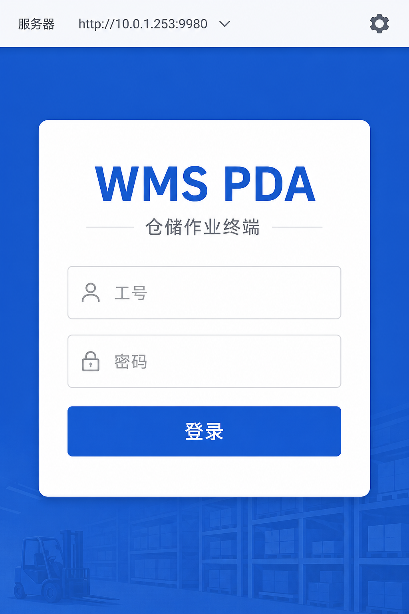
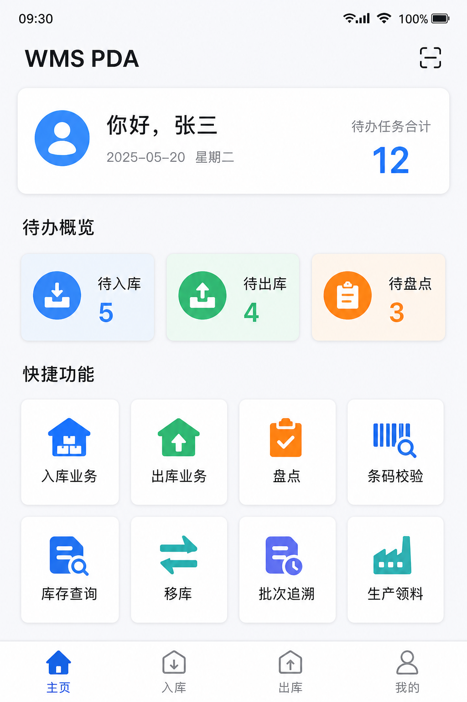
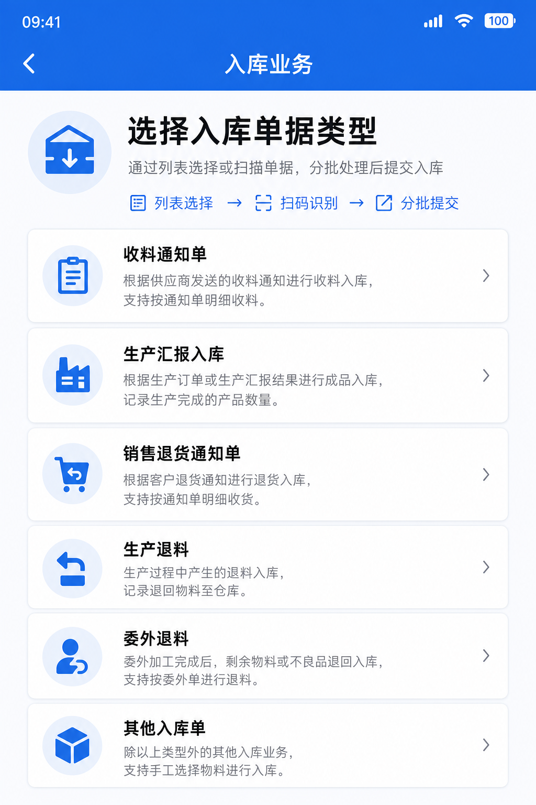
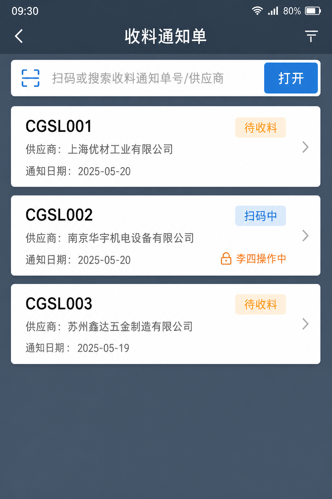
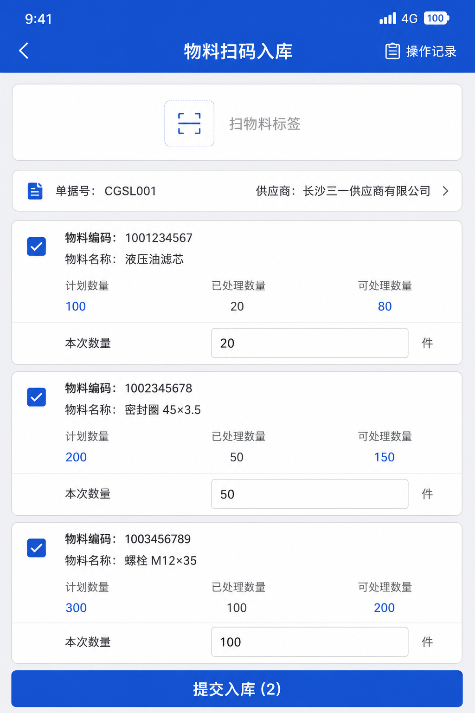
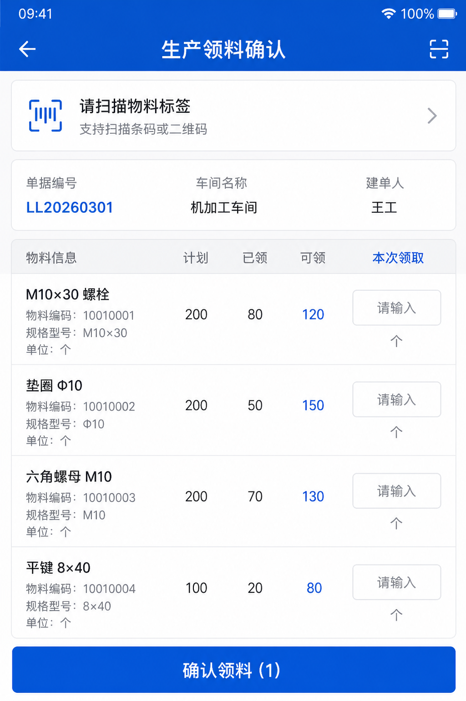
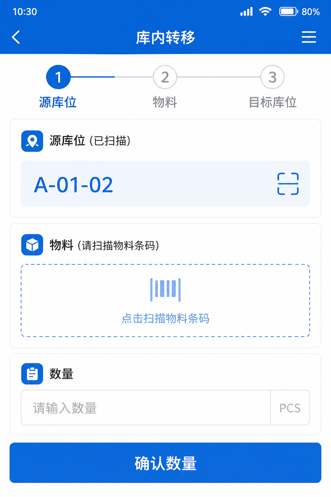

# WMS PDA 操作手册

> 版本 V1.0 · 适用手持终端 / Android PDA · 编制日期 2026-09

本手册面向仓库现场作业人员，说明 WMS PDA 端的登录、扫码入库、出库领料、盘点移库等操作。界面示意为示意图，实际以设备上界面为准。

---

## 1. 使用前准备

### 1.1 设备与网络

- 手持 PDA 已安装本系统客户端（APK 或 HBuilderX 打包的应用）。
- 终端能访问 WMS 服务器（与 Web 端同一后端，默认端口 **9980**）。
- 扫码枪模式一般为「键盘楔入」：扫完自动回车即可，无需点输入框。

### 1.2 首次配置服务器

1. 打开应用进入登录页。
2. 点击顶部 **服务器** 栏（或齿轮图标）进入系统设置。
3. 填写服务器地址，例如：`http://10.0.1.253:9980`（按现场实际 IP）。
4. 保存后返回登录页，确认顶部显示的地址正确。

### 1.3 登录

1. 输入 **工号**、**密码**。
2. 点击 **登录**。
3. 成功后进入 **工作台**。

> 提示：账号与 Web「系统管理 → 用户」一致；无权限的业务入口可能不可见或操作时提示无权限。

---

## 2. 工作台与导航

### 2.1 工作台首页

登录后默认进入 **主页**：

- 欢迎语与 **待办任务合计**
- **待办概览**：待入库 / 待出库 / 待盘点（可点击跳转）
- **快捷功能**：入库业务、出库业务、盘点、条码校验、库存查询、移库、批次追溯、生产领料相关入口、消息等

底部 Tab：**主页** | **入库** | **出库** | **我的**

### 2.2 「我的」常用操作

在 **我的** 中可查看工号、仓库、设备信息，并执行：

- **检查更新**：下载热更新包或整包（按服务器配置）
- **系统设置**：修改服务器地址
- **退出登录**

---

## 3. 通用扫码规则（必读）

几乎所有单据类业务都遵循同一模式：

| 步骤 | 扫什么 | 在哪里 |
|------|--------|--------|
| ① 选单 | 单据二维码，或搜索单号 | 列表页顶部扫码/搜索框 |
| ② 扫料 | 物料标签二维码 | 明细页顶部扫码框 |
| ③ 改数 | 手改「本次」数量（可选） | 明细行输入框 |
| ④ 提交 | 点底部确认按钮 | 同步金蝶后弹窗提示成败 |

### 3.1 单据独占锁

同一单据同一时间只允许一人操作。若提示「单据正被其他人操作」或列表显示「某某操作中」，请等待对方退出或联系管理员释放锁。

### 3.2 物料标签要求

请扫描系统打印的 **物料标签二维码**。条码格式错误、物料不在本单、数量已领满时，界面会 Toast 提示具体原因。

### 3.3 提交与金蝶

提交后会把数量回写到金蝶相关单据并（按单据类型）提交/审核。弹窗会显示成功或失败原因，点 **知道了** 关闭。失败时本地「已处理/可处理」数量一般保持不变，可修改后重新提交。

---

## 4. 入库业务

### 4.1 进入方式

- 工作台 → **入库业务**，或底部 Tab **入库**
- 选择单据类型后进入列表

常见类型说明：

| 类型 | 说明 |
|------|------|
| 收料通知单 | 采购收料入库 |
| 生产汇报入库 | 扫已审核生产汇报，生成入库并反写 |
| 销售退货通知单 | 扫已审核退货通知，生成销售退货 |
| 生产退料 / 委外退料 | 独立领退页面，扫未审核单据后确认退料 |
| 其他入库单 | 扫未审核其他入库单后提交审核 |

### 4.2 列表：找单 / 扫单

1. 在搜索框扫 **单据二维码**，或输入单号/供应商关键词后点 **打开**。
2. 点列表中的单据卡片进入明细。
3. 状态常见：**待收料** / **扫码中** / **已完成**（已完成一般不再出现在待办列表）。

### 4.3 明细：扫料 → 提交入库

1. 用顶部扫码框扫描 **物料标签**，系统自动勾选对应行并累加本次数量。
2. 可手改「本次」数量；入库类业务按页面选择 **仓库 / 库位**（如有）。
3. 确认勾选行无误后，点底部 **提交入库 (n)**。
4. 查看金蝶同步结果弹窗。

> 提示：数量不能超过单据「可处理」剩余量；超出会提示，请改小后再提交。

---

## 5. 出库业务

### 5.1 进入方式

工作台 → **出库业务**，或底部 Tab **出库**，选择类型：

| 类型 | 操作要点 |
|------|----------|
| 销售发货通知单 | 扫已审核发货通知 → 确认后下推销售出库并审核 |
| 采购退料单 | 扫采购退料单 → 填实退数量 → 提交出库并回写金蝶 |
| 生产领料 | 见第 6 章（标准流程：扫码填数 → 确认领料即审核） |
| 委外领料 / 生产补料 / 委外补料 | 对应独立页面，底部「确认领料/确认补料」 |
| 其他出库 / 生产退库 | 通用通知单扫码页 → **提交出库** |

### 5.2 通用出库扫码步骤

与入库相同：**列表扫单 → 明细扫物料标签 → 改本次数量 → 提交出库**。出库明细页通常不选库位（按单据/库存规则出库）。

销售发货失败后请勿盲目重复下推：系统会尽量复用已生成的暂存出库单；若仍失败，根据弹窗中的金蝶提示处理（如批号、仓库未填等）。

---

## 6. 生产领料（标准流程）

生产领料为 **单阶段** 流程：进入明细 → 扫物料标签 → 填数量 → **确认领料** → 回写金蝶实发并 **立即审核**。审核完成后该单离开 PDA 列表；金蝶 **反审核** 后可再次出现在列表中重新操作。

### 6.1 操作步骤

1. 出库业务 → **生产领料**（或快捷入口）。
2. 列表拉取金蝶 **审核中** 的生产领料单；可扫单号或按车间搜索。
3. 进入明细，扫物料标签；查看 **计划 / 已领 / 可领**，填写 **本次领取**。
4. 点 **确认领料 (n)**。
5. 成功后单据在金蝶变为已审核；PDA 返回列表。

### 6.2 注意

- 每次提交都会审核该领料单（按当前配置），请一次确认好数量。
- 物料不在本单、已领满会提示，不可强行超领。
- 反审核后重新进入时，本地扫码进度会重置，请按最新单据重新扫码。

---

## 7. 生产 / 委外 · 退料与补料

| 业务 | 入口 | 底部按钮 |
|------|------|----------|
| 生产退料 | 快捷 / 入库或产品模块 | **确认退料** |
| 委外退料 | 快捷 / 入库 hub | **确认退料** |
| 生产补料 | 快捷 / 出库 hub | **确认补料** |
| 委外补料 | 快捷 / 出库 hub | **确认补料** |
| 委外领料 | 出库 hub | **确认领料** |

操作同样是：列表找未审核单据 → 扫物料标签 → 确认提交 → 金蝶回写并审核。部分页面要求必须先扫标签才能勾选行。

---

## 8. 盘点

1. 工作台 → **盘点**，列表显示金蝶未审核盘点作业。
2. 扫盘点单二维码或搜索单号进入。
3. 扫物料标签或手输 **实盘数量**。
4. 可点 **刷新** 同步最新数据；全部录入后点 **提交审核**。
5. 确认弹窗后，系统回写实盘数量并对该盘点单提交审核。

---

## 9. 移库

按三步完成：

1. 扫 **源库位** 条码。
2. 扫 **物料标签**，确认本次移库数量（**确认数量**）。
3. 扫 **目标库位**，点 **确认移库**。

---

## 10. 其他常用功能

### 10.1 库存查询

输入物料编码或扫标签，查询当前仓库/库位库存。

### 10.2 条码校验

用于核对：先扫单据，再扫物料标签，检查物料是否属于该单。

### 10.3 批次追溯

按物料编码 + 批次，或直接扫标签，查询出入库履历。

### 10.4 消息中心

查看系统推送的业务消息；可 **全部已读**。部分历史消息可跳转到对应单据明细。

---

## 11. 常见问题

| 现象 | 处理建议 |
|------|----------|
| 登录失败 / 网络错误 | 检查服务器地址、Wi-Fi、后端是否启动（9980） |
| 扫码无反应 | 确认光标在扫码框；扫码枪是否配置后缀回车 |
| 单据被锁定 | 等对方退出明细页，或由管理员释放锁 |
| 金蝶同步失败 | 阅读弹窗完整错误；改数量或补全金蝶必填项后重试 |
| 列表没有单据 | 确认金蝶单据状态是否符合该业务（如领料需「审核中」） |
| 反审核后仍显示已领完 | 下拉刷新列表重新进入；系统会按金蝶状态重开会话 |

---

## 12. 附录 · 界面附图索引

| 图号 | 内容 |
|------|------|
| 图1-1 | 登录页 |
| 图2-1 | 工作台首页 |
| 图4-1 | 入库业务类型选择 |
| 图4-2 | 收料通知单列表 |
| 图4-3 | 物料扫描 / 提交入库 |
| 图6-1 | 生产领料确认 |
| 图9-1 | 移库作业 |

— 全文完 —
