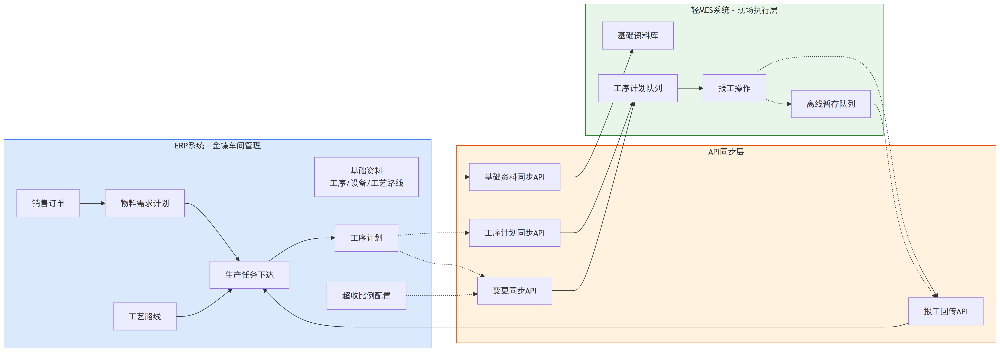
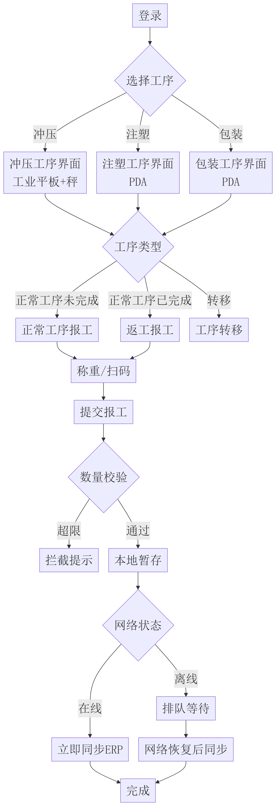

轻MES应用
需求规格说明书
金蝶云产品需求规格说明书（专题需求规格说明书）

| 云 | 金蝶AI星空 |
| --- | --- |
| 领域 | MES |
| 应用 | 车间管理+轻MES |
| 版本 | R1.0 |
| 日期 | 2026-09-02 |
| 特性编码 |  |

| Ver.No | 日期 | 编制-修订 | 审核 | 批准 | 章节号 |
| --- | --- | --- | --- | --- | --- |
| R1.0 | 20260902 |  |  |  | 初始版本 |

②机密信息严禁泄露

# 1.需求背景介绍
## 1.1客户原始需求描述
客户名称：_羽墨___。
原始需求：依托金蝶车间管理（ERP）开发轻量化MES（制造执行系统）应用，作为车间现场执行层，覆盖冲压、注塑、包装三大工序的现场报工、转移、称重等核心执行场景，并与ERP进行双向数据同步。
原始需求项摘要如下：
基础资料同步：将ERP车间管理的工序、设备、工艺路线同步至轻MES。
工序计划同步与变更：ERP工序计划下达后同步至轻MES执行；ERP工单变更与工序计划数量变更时，轻MES同步更新（不受状态影响）；已报工的订单变更数量只能变多，工序计划数量变更只能为报工变更。
报工数量控制：轻MES报工数量受工序计划数量控制，且需考虑ERP车间管理的超收比例。
异步报工同步：轻MES报工完成后5分钟内通过API同步至ERP，生成报工单或工序转移单；ERP网络中断时MES可继续执行，网络恢复后继续同步。
返工工序处理：工序报工后发现不良需产生返工工序，MES需考虑返工工序序列；正常工序未报完时人员需选择"正常报工"或"返工报工"，正常工序完成后仅可"返工报工"。
## 1.2业务场景及痛点分析
### 1.2.1用户画像

| 角色 | 描述 | 主要诉求 |
| --- | --- | --- |
| 车间主管 | 冲压部、注塑部、包装部负责人 | 实时掌握工序执行进度，及时处理异常 |
| 车间操作员 | 工序现场作业人员 | 快速扫码报工、转移，避免手写单据 |
| 车间操作员 | 冲压/注塑部负责称重的人员 | 通过工业平板+电子秤完成称重报工 |
| 计划员（ERP） | ERP端负责返工计划员 | 发现不良时及时发起返工流程 |
| 计划员（ERP） | ERP端负责生产计划下达 | 在ERP完成计划下达，希望MES端自动同步 |
| 车间管理员（ERP） | ERP端车间基础资料维护人员 | 维护工序/设备/工艺路线，MES自动同步 |

### 1.2.2业务场景
场景一：冲压/注塑工序报工。员工完成冲压后，将框料带至固定称重点，称重员在工业平板选择工序、人员、机台，系统记录重量并打印条码粘贴框料，后续通过PDA扫码完成工序交接。
场景二：批锋/包装工序报工。员工使用手机或PDA直接扫码报工，使用普通电子秤称重（不与系统对接）。
场景三：工序转移。各工序完成后，同工作中心自动转移，跨车间需通过PDA扫码进行工序转移，将半成品流转到下一工序。
场景四：返工处理。某工序报工后发现不良，计划发起返工，生成返工工序计划，并在工时区分正常报工与返工报工。
场景五：ERP网络中断。车间网络中断时，操作员继续在MES端执行报工操作，MES本地暂存数据，网络恢复后自动同步至ERP。
### 1.2.3痛点分析

| 痛点 | 现状 | 影响 |
| --- | --- | --- |
| 现场作业与ERP脱节 | 现场仍以纸质单据为主，报工数据滞后1-2天 | 计划员无法实时掌握进度，调度决策延迟 |
| 数据二次录入 | ERP车间管理与现场MES系统数据需重复录入 | 增加工作量，提高出错率 |
| 不良返工流程不规范 | 返工依赖人工跟踪，工序序列不清晰 | 返工追溯困难，统计口径不一 |
| 超收控制缺乏系统约束 | 报工数量由人工核对，易超出计划 | 物料消耗失控，成本核算失真 |
| 网络中断即停摆 | MES依赖网络，断网即停工 | 影响连续生产能力 |
| 变更同步不及时 | ERP计划变更后，MES端不能及时更新 | 执行与计划脱节，库存偏差 |

# 2.整体实现思路
## 2.1业务流程图
ERP与轻MES之间的数据通过API同步层进行双向流转，基础资料、工序计划、变更消息由ERP流向轻MES，报工结果由轻MES回传至ERP，整体数据同步流程如下图所示。
图2.1-1ERP与轻MES数据同步流程图
## 2.2页面流程图
现场操作员登录轻MES后，按所选工序进入对应报工界面，完成正常工序报工、返工报工或工序转移，提交后经数量校验与网络状态判断进入同步或暂存环节，页面流转过程如下图所示。

图2.2-1现场操作页面流转图
## 2.3二开兼容评估
### 2.3.1字段增删改影响范围

| 模块 | 变更项 | 影响范围 | 兼容性评估 |
| --- | --- | --- | --- |
| 车间管理基础资料 | 无新增/删除/修改字段，仅读取工序、设备、工艺路线 | 全部为新增的轻MES端字段 | 不影响ERP现有二开 |
| 工序计划单据 | 轻MES端新增：MES同步状态、最后同步时间、MES端已报工数量 | ERP端无需新增字段 | 不影响ERP二开，MES端独立扩展 |
| 报工单据 | 轻MES端生成独立报工单（不直接复用ERP表单） | 通过API在ERP生成标准报工单 | 不影响ERP现有报工逻辑 |
| 工序转移单据 | 轻MES端生成独立转移单 | 通过API在ERP生成标准转移单 | 不影响ERP现有转移逻辑 |
| 超收比例 | 读取ERP车间管理配置参数，不修改 | 仅新增读取接口 | 不影响ERP配置 |

### 2.3.2二开兼容性结论
ERP端：本特性不涉及ERP端字段增删改，仅新增API出口（基础资料查询、工序计划推送、报工单生成），不影响现有二开。
轻MES端：作为新建独立应用，所有功能均独立扩展，无需考虑存量二开兼容。
数据迁移：本特性不涉及存量数据迁移，基础资料、工序计划均通过API实时同步获取。
升级处理：当ERP端车间管理相关单据结构升级时，需同步更新API契约，是否API版本化管理（例如/api/v1/、/api/v2/）。
# 3.用户故事及需求实现
## 3.1用户故事1：车间管理基础资料同步
### 3.1.1用户故事描述
作为一个车间管理员（ERP端），我想要将车间管理维护的工序、设备、工艺路线同步至轻MES，以便轻MES现场作业有准确的基础数据支撑报工与转移操作。
### 3.1.2用户故事清单

| 编号 | 用户故事描述 | 优先级 | 依赖关系 |
| --- | --- | --- | --- |
| US1.1 | 工序基础资料从ERP同步至轻MES（工序编码、名称、所属部门、是否报工、是否转移、是否质检） | Must | 无 |
| US1.2 | 设备基础资料从ERP同步至轻MES（设备编码、名称、所属工序、规格型号） | Must | 无 |
| US1.3 | 工艺路线从ERP同步至轻MES（产品BOM、工序序列、工序前置关系、标准工时） | Must | US1.1 |
| US1.4 | 基础资料变更（新增/修改/停用）实时同步至轻MES | Must | US1.1/US1.2/US1.3 |
| US1.5 | 轻MES端对基础资料为只读，不可修改 | Must | US1.1/US1.2/US1.3 |

### 3.1.3前置条件与约束
ERP端车间管理已完成工序、设备、工艺路线基础资料维护，数据准确可用。
ERP端已提供基础资料查询与同步API，并完成接口鉴权配置。
轻MES端已完成本地基础资料库初始化，具备本地持久化存储能力。
轻MES端对基础资料仅提供查询能力，不支持新增、修改、删除操作。
### 3.1.4用户界面
轻MES端"基础资料查询"页面以列表形式展示工序、设备、工艺路线信息，页面仅提供查询与查看能力，不提供编辑功能（未来支持）。页面路径为：轻MES>基础资料>基础资料查询。
### 3.1.5界面元素说明

| 工序列表 | 工序编码、工序名称、所属部门、是否报工工序、是否转移工序、是否质检工序、状态。 |
| --- | --- |
| 设备列表 | 设备编码、设备名称、所属工序、规格型号、状态。 |
| 工艺路线 | 产品编码、产品名称、工序序列（树形展示）、标准工时、版本号。 |
| 同步状态列 | 列表行显示"已同步"、"同步中"、"同步失败"三种状态。 |

### 3.1.6操作按钮

| 序号 | 按钮名称 | 功能说明 |
| --- | --- | --- |
| 1 | 【刷新】 | 手动触发基础资料同步，调用ERP同步API更新本地缓存。 |
| 2 | 【查看详情】 | 点击任一记录，弹出详情弹窗，展示完整字段信息。 |
| 3 | 【同步状态】 | 列表行同步状态列，显示"已同步"、"同步中"、"同步失败"。 |

### 3.1.7主要业务逻辑
#### 3.1.7.1同步触发机制
同步触发方式（支持三种）：
①ERP端基础资料保存后，主动推送变更消息至MES（推荐）；
②MES端定时轮询（默认每30分钟一次，可配置）；
③MES端【刷新】按钮手动触发（应急使用）。
#### 3.1.7.2同步内容规则
工序：以"工序编码"为主键，新增、修改、停用均同步；状态为"停用"的工序在MES端不展示为可选项。
设备：以"设备编码"为主键；状态为"停用"的设备在MES端可选列表中过滤。
工艺路线：以"产品编码+版本号"为主键；MES端按当前有效版本加载。
#### 3.1.7.3冲突处理
当ERP与MES端同一基础资料版本不一致时，以ERP端为权威源，MES端覆盖本地数据。
当MES端存在未同步完成的报工、转移操作时，基础资料变更不影响已暂存数据。
#### 3.1.7.4异常处理

| 异常条件 | 系统行为 | 用户提示语 | 日志记录 |
| --- | --- | --- | --- |
| ERP接口超时（晚于30秒） | MES端标记为"同步失败"，下次轮询重试 | "基础资料同步失败，请稍后重试或联系管理员。" | 记录接口调用时间、请求参数、错误堆栈 |
| ERP接口返回500 | MES端标记为"同步失败"，告警通知管理员 | "ERP系统异常，请稍后重试。" | 记录错误码、响应内容 |
| 字段映射错误（ERP字段缺失） | MES端跳过该条记录，记录失败日志 | "部分基础资料同步失败，已记录到日志，请联系管理员处理。" | 记录缺失字段、主键 |
| 网络断开 | MES端标记"同步失败"，本地保留旧版本数据 | "当前网络异常，基础资料为本地缓存版本。" | 记录网络断开时间、持续时长 |

### 3.1.8功能权限

| 角色 | 工序 | 设备 | 工艺路线 |
| --- | --- | --- | --- |
| 车间管理员 | 查看、刷新 | 查看、刷新 | 查看、刷新 |
| 车间主管 | 查看 | 查看 | 查看 |
| 车间操作员 | 查看 | 查看 | 不涉及 |
| 称重员 | 查看 | 查看 | 不涉及 |
| 质检员 | 查看 | 查看 | 不涉及 |

权限配置：通过MES端"角色权限"界面绑定，默认与车间管理ERP角色映射。
### 3.1.9数据用例
不涉及。
### 3.1.10升级处理
不涉及。
### 3.1.11关联性需求
依赖ERP车间管理提供基础资料同步API。
与"工序计划同步"（US2）共享基础资料缓存。
与"超收比例同步"（US3）共用ERP接口调用框架。
## 3.2用户故事2：车间管理工序计划同步与变更管理
### 3.2.1用户故事描述
作为一个计划员（ERP端），想要在ERP端下达工序计划后，轻MES自动同步并支持工单变更与工序计划数量变更同步，以便现场执行与计划保持一致。
### 3.2.2用户故事清单

| 编号 | 用户故事描述 | 优先级 | 依赖关系 |
| --- | --- | --- | --- |
| US2.1 | ERP工序计划下达后1分钟内同步至轻MES | Must | US1 |
| US2.2 | ERP工单变更（数量、计划日期、状态）同步至轻MES，不受工单/工序状态影响 | Must | US2.1 |
| US2.3 | ERP工序计划数量变更同步至轻MES | Must | US2.1 |
| US2.4 | 已报工的工单变更数量只能增加（不能减少） | Must | US2.2 |
| US2.5 | 工序计划数量变更只能为"追加变更"（仅增加） | Must | US2.3 |
| US2.6 | MES端展示同步状态，便于计划员跟踪 | Should | US2.1 |
| US2.7 | 变更同步失败时支持手动重试 | Should | US2.2/US2.3 |

### 3.2.3前置条件与约束
已完成US1基础资料同步，工序、设备、工艺路线数据在轻MES端可用。
ERP端工序计划已录入并完成审核下达。
ERP端已提供工序计划同步API与工单变更同步API。
已报工场景下数量变更只允许增加，减少操作由系统拒绝。
### 3.2.4用户界面
轻MES端"工序计划列表"页面分页显示同步至MES的工序计划，支持按工单号、产品编码、状态、计划日期筛选。页面路径为：轻MES>工序计划>工序计划列表。
### 3.2.5界面元素说明

| 字段名 | 字段类型 | 默认值 | 字段来源 | 控制说明 | 是否必录 |
| --- | --- | --- | --- | --- | --- |
| 工单号 | 文本 | 空 | ERP同步 | 不可编辑 | 是 |
| 产品编码 | 文本 | 空 | ERP同步 | 不可编辑 | 是 |
| 产品名称 | 文本 | 空 | ERP同步 | 不可编辑 | 是 |
| 工序编码 | 文本 | 空 | ERP同步 | 不可编辑 | 是 |
| 工序名称 | 文本 | 空 | ERP同步 | 不可编辑 | 是 |
| 计划数量 | 数值 | 0 | ERP同步 | 不可编辑（MES仅展示） | 是 |
| 已报工数量 | 数值 | 0 | MES累计 | 不可编辑 | 是 |
| MES同步状态 | 单选 | 未同步 | MES计算 | 不可编辑 | 是 |
| 最后同步时间 | 日期时间 | 空 | MES计算 | 不可编辑 | 是 |
| 计划开始日期 | 日期 | 空 | ERP同步 | 不可编辑 | 是 |
| 计划完成日期 | 日期 | 空 | ERP同步 | 不可编辑 | 是 |
| 状态 | 单选 | 待下达 | ERP同步 | 不可编辑 | 是 |

### 3.2.6操作按钮

| 序号 | 按钮名称 | 功能说明 |
| --- | --- | --- |
| 1 | 【查看详情】 | 点击行查看工序计划详情，包括工艺路线、关联工单。 |
| 2 | 【手动重试同步】 | 当MES同步状态为"同步失败"时可用，点击触发重新同步。 |
| 3 | 【刷新列表】 | 手动刷新当前列表数据。 |
| 4 | 【筛选】 | 按工单号、产品编码、状态、日期筛选。 |

### 3.2.7主要业务逻辑
#### 3.2.7.1工序计划下达同步
同步触发条件：ERP端"工序计划"保存并审核后触发。
同步时效：1分钟内必须同步至MES端。
同步字段：工单号、产品编码、工序编码、计划数量、计划日期、工艺路线。
#### 3.2.7.2工单变更同步
变更范围：工单数量、计划开始/完成日期、工单状态、工艺路线变更。
同步时效：ERP端变更保存后1分钟内同步至MES。
状态不受限：无论工单状态是"已下达"、"生产中"、"已暂停"、"已关闭"，变更均同步至MES。
数量变更规则（关键约束）如下表所示。

| 工单当前报工情况 | ERP端变更操作 | MES端响应 |
| --- | --- | --- |
| 未报工 | 数量增加 | 接受，同步新数量 |
| 未报工 | 数量减少 | 接受，同步新数量（但不允许小于0） |
| 已报工 | 数量增加 | 接受，同步新数量 |
| 已报工 | 数量减少 | 拒绝变更，提示"已报工订单数量只能增加。" |
| 已报工 | 数量=已报工数量 | 接受（无变化） |

#### 3.2.7.3工序计划数量变更
数量变更类型：仅"追加变更"（即只能增加，不能减少）。
变更触发：ERP端在工序计划上"追加数量"，并填写追加原因。
同步时效：1分钟内同步至MES。
数量变更规则如下表所示。

| 当前情况 | 变更操作 | MES端响应 |
| --- | --- | --- |
| 已报工数量小于计划数量 | 计划数量增加 | 接受，更新计划数量 |
| 已报工数量等于计划数量 | 计划数量增加 | 接受，作为新追加 |
| 已报工数量等于计划数量 | 计划数量减少 | 拒绝，提示"工序计划数量只能追加。" |

#### 3.2.7.4同步状态字段

| 状态值 | 含义 | 触发条件 |
| --- | --- | --- |
| 未同步 | MES端未收到该工序计划 | 初始状态 |
| 已同步 | MES端已成功接收 | 同步成功后 |
| 同步中 | MES端正在接收 | 同步进行中 |
| 同步失败 | 同步过程出错 | 异常时 |

### 3.2.8功能权限

| 角色 | 查看列表 | 查看详情 | 手动重试同步 |
| --- | --- | --- | --- |
| 车间管理员 | √ | √ | √ |
| 车间主管 | √ | √ | √ |
| 计划员 | √ | √ | √ |
| 车间操作员 | √ | √ | × |

### 3.2.9数据用例
不涉及。
### 3.2.10升级处理
不涉及。
### 3.2.11关联性需求
依赖US1基础资料，必须先有工序、设备数据才能同步工序计划。
关联US3报工数量控制，已报工数量是判断数量变更能否生效的依据。
关联US4异步同步，变更消息通过相同的同步通道推送。
## 3.3用户故事3：现场报工与数量控制
### 3.3.1用户故事描述
作为一个车间操作员，我想要在工序完成后通过扫码或称重快速报工，且系统能自动校验报工数量（含超收比例），以便确保报工数据准确并与ERP计划一致。
### 3.3.2用户故事清单

| 编号 | 用户故事描述 | 优先级 | 依赖关系 |
| --- | --- | --- | --- |
| US3.1 | 现场通过PDA/工业平板扫码触发报工 | Must | US2 |
| US3.2 | 冲压工序通过工业平板+电子秤称重报工 | Must | US2 |
| US3.3 | 报工数量受工序计划数量×（1+超收比例）上限约束 | Must | US2,US3.4 |
| US3.4 | 轻MES实时从ERP获取超收比例配置 | Must | ERP配置 |
| US3.5 | 超限报工系统拦截并提示 | Must | US3.3 |
| US3.6 | 报工记录自动关联工单、工序、操作员、设备、时间 | Must | US2 |
| US3.7 | 支持多人并发报工同一工序（队列锁机制） | Should | US3.1 |

### 3.3.3前置条件与约束
已完成US2工序计划同步，"生产工单编号"对应工序计划在轻MES端可用。
现场已配备PDA或工业平板，冲压工序已配备可与系统对接的电子秤。
ERP端车间管理已完成超收比例配置，轻MES可实时读取。
"生产工单编号"为必录项，通过扫码获取后自动填充。
### 3.3.4用户界面
冲压工序通过工业平板报工，界面集成电子秤读数与条码打印；注塑、包装工序通过PDA报工，界面以扫码录入为主。页面路径为：轻MES>现场作业>工序报工。
### 3.3.5界面元素说明
冲压工序报工界面（工业平板）元素说明如下表所示。

| 字段名 | 字段类型 | 默认值 | 字段来源 | 控制说明 | 是否必录 |
| --- | --- | --- | --- | --- | --- |
| 工单号 | 文本（扫码） | 空 | 扫码获取 | 扫码后自动填充 | 是 |
| 工序 | 单选 | 冲压开料 | 工序列表 | 仅显示该工单可执行工序 | 是 |
| 重量（kg） | 数值（电子秤） | 0 | 电子秤读数 | 自动读取，可手动覆盖 | 是 |
| 数量 | 数值 | 1 | 默认值 | 可调整，但受计划数量约束 | 是 |
| 设备 | 单选 | 空 | 设备列表 | 必选当前可用设备 | 是 |
| 操作员 | 单选 | 当前用户 | 当前登录 | 默认填充当前用户 | 是 |
| 备注 | 文本 | 空 | 人工输入 | 可选 | 否 |

注塑/包装工序报工界面（PDA）元素说明如下表所示。

| 字段名 | 字段类型 | 默认值 | 字段来源 | 控制说明 | 是否必录 |
| --- | --- | --- | --- | --- | --- |
| 工单号 | 文本（扫码） | 空 | 扫码获取 | 扫码后自动填充 | 是 |
| 工序 | 单选 | 空 | 工序列表 | 仅显示该工单可执行工序 | 是 |
| 数量 | 数值 | 1 | 默认值 | 可调整，但受计划数量约束 | 是 |
| 设备 | 单选 | 空 | 设备列表 | 必选当前可用设备 | 是 |
| 操作员 | 单选 | 当前用户 | 当前登录 | 默认填充当前用户 | 是 |
| 备注 | 文本 | 空 | 人工输入 | 可选 | 否 |

### 3.3.6操作按钮

| 序号 | 按钮名称 | 功能说明 |
| --- | --- | --- |
| 1 | 【扫码】 | 调用PDA/平板摄像头扫码，识别工单条码或工序条码。 |
| 2 | 【称重】（仅冲压） | 触发电子秤读数，自动填充重量字段。 |
| 3 | 【提交报工】 | 校验通过后提交报工，进入同步队列。 |
| 4 | 【取消】 | 放弃当前报工操作，返回上级页面。 |
| 5 | 【打印条码】 | 报工成功后打印框料条码。 |

### 3.3.7主要业务逻辑
#### 3.3.7.1报工数量控制规则
核心公式：报工数量上限=工序计划数量×(1+超收比例)。
其中：超收比例由ERP车间管理配置，默认0%（即不允许超收）。
数量校验流程如下：
系统读取当前工序的"计划数量"、"已报工数量"、"超收比例"。
计算本次允许的最大报工数量=计划数量×(1+超收比例)−已报工数量。
用户输入的"本次报工数量"小于或等于最大报工数量时，校验通过。
用户输入的"本次报工数量"大于最大报工数量时，系统拦截并提示"报工数量超出计划上限，请调整后重新提交。"
#### 3.3.7.2超收比例取值规则

| 优先级 | 来源 | 说明 |
| --- | --- | --- |
| 1 | 工序级超收比例 | 在工序基础资料中配置（ERP） |
| 2 | 产品级超收比例 | 在工艺路线中配置（ERP） |
| 3 | 默认超收比例 | 系统参数（ERP）默认0% |

取值逻辑：优先取工序级，无工序级时取产品级，两者均无时取默认值。
#### 3.3.7.3报工提交后状态变更

| 步骤 | 动作 |
| --- | --- |
| ① | MES端校验通过后，生成"报工记录"（本地） |
| ② | MES端更新该工序的"已报工数量" |
| ③ | 报工记录进入同步队列（详见US4） |
| ④ | 5分钟内同步至ERP，生成报工单 |
| ⑤ | 报工成功提示给操作员 |

#### 3.3.7.4并发报工处理
当多人同时对同一工序进行报工时，采用工序级排队机制：
①系统按"工序+工单"维度加锁；
②第一个请求获取锁后，其他请求进入等待队列；
③锁释放后，队列中的下一个请求获取锁；
④等待超过30秒未获取锁时，提示"工序繁忙，请稍后重试。"
### 3.3.8功能权限

| 角色 | 扫码报工 | 称重报工 | 提交报工 | 打印条码 |
| --- | --- | --- | --- | --- |
| 车间操作员 | √ | √（冲压） | √ | √ |
| 称重员 | × | √（冲压） | √ | √ |
| 质检员 | × | × | × | × |
| 车间主管 | √ | √ | √ | √ |

### 3.3.9数据用例
不涉及。
### 3.3.10升级处理
不涉及。
### 3.3.11关联性需求
强依赖US2工序计划同步，必须先有计划才能报工。
强依赖US4异步同步，报工后通过异步通道推送到ERP。
关联US5返工工序，返工工序报工同样受本约束规则约束。
与US1基础资料同步共享工序、设备数据。
## 3.4用户故事4：异步报工同步与离线容错
### 3.4.1用户故事描述
作为一个车间操作员，我希望在网络正常时报工后5分钟内同步至ERP，并在断网时能继续报工、网络恢复后自动同步，以确保现场作业不中断且数据不丢失。
### 3.4.2用户故事清单

| 编号 | 用户故事描述 | 优先级 | 依赖关系 |
| --- | --- | --- | --- |
| US4.1 | 报工成功后5分钟内通过API同步至ERP | Must | US3 |
| US4.2 | 同步成功后ERP自动生成报工单 | Must | US4.1 |
| US4.3 | 工序转移成功后5分钟内同步至ERP生成工序转移单 | Must | US2 |
| US4.4 | 断网时MES继续接收报工，本地暂存 | Must | US3 |
| US4.5 | 网络恢复后自动同步暂存数据至ERP | Must | US4.4 |
| US4.6 | 同步状态可视化（已同步/同步中/待同步/同步失败） | Must | US4.1/US4.3 |
| US4.7 | 同步失败重试机制（指数退避，最多重试5次） | Must | US4.1 |
| US4.8 | 暂存数据有效期管理（默认保留30天） | Should | US4.4 |
| US4.9 | 暂存数据异常告警 | Should | US4.4 |

### 3.4.3前置条件与约束
已完成US3报工，报工记录已生成并进入同步队列。
ERP端已提供报工单生成API与工序转移单生成API。
轻MES端本地数据库可用，具备持久化存储与崩溃恢复能力。
车间网络允许偶发中断，长期断网场景下需人工介入处理暂存数据。
### 3.4.4用户界面
轻MES端提供"同步状态面板"，供车间主管、车间管理员实时掌握队列情况；同时提供"报工记录列表"，展示每条记录的同步状态与失败原因。页面路径为：轻MES>同步中心>同步状态面板/报工记录。
### 3.4.5界面元素说明
同步状态面板（车间主管/管理员可见）元素说明如下表所示。

| 字段名 | 字段类型 | 默认值 | 字段来源 | 控制说明 | 是否必录 |
| --- | --- | --- | --- | --- | --- |
| 同步队列总数 | 数值 | 0 | 系统计算 | 实时 | 是 |
| 待同步数量 | 数值 | 0 | 系统计算 | 实时 | 是 |
| 同步中数量 | 数值 | 0 | 系统计算 | 实时 | 是 |
| 同步失败数量 | 数值 | 0 | 系统计算 | 实时 | 是 |
| 已同步数量（今日） | 数值 | 0 | 系统计算 | 实时 | 是 |
| 网络状态 | 单选 | 在线 | 系统监测 | 实时 | 是 |
| 最后同步时间 | 日期时间 | 空 | 系统计算 | 实时 | 是 |

报工记录列表（包含同步状态）元素说明如下表所示。

| 字段名 | 字段类型 | 默认值 | 字段来源 | 控制说明 | 是否必录 |
| --- | --- | --- | --- | --- | --- |
| 报工单号 | 文本 | 空 | 系统生成 | 不可编辑 | 是 |
| 工单号 | 文本 | 空 | 扫码获取 | 不可编辑 | 是 |
| 工序 | 文本 | 空 | 扫码获取 | 不可编辑 | 是 |
| 数量 | 数值 | 0 | 操作员输入 | 不可编辑 | 是 |
| 操作员 | 文本 | 空 | 当前用户 | 不可编辑 | 是 |
| 报工时间 | 日期时间 | 当前时间 | 系统记录 | 不可编辑 | 是 |
| 同步状态 | 单选 | 待同步 | 系统计算 | 不可编辑 | 是 |
| 同步时间 | 日期时间 | 空 | 系统计算 | 不可编辑 | 否 |
| 失败原因 | 文本 | 空 | 系统计算 | 同步失败时显示 | 否 |

### 3.4.6操作按钮

| 序号 | 按钮名称 | 功能说明 |
| --- | --- | --- |
| 1 | 【手动重试】 | 对同步失败的记录，点击后立即重试。 |
| 2 | 【查看详情】 | 查看报工记录详情。 |
| 3 | 【取消暂存】 | 管理员可取消某条暂存记录，需输入原因。 |
| 4 | 【导出】 | 导出报工记录为Excel。 |

### 3.4.7主要业务逻辑
#### 3.4.7.1同步流程（在线状态）
[报工成功]
↓
[生成报工记录]→本地存储
↓
[加入异步队列]（状态：待同步）
↓
[Worker拉取队列]→状态变更为：同步中
↓
[调用ERPAPI]（POST/api/v1/production-report）
↓
[ERP处理成功]→状态变更为：已同步+记录ERP报工单号
[ERP处理失败]→状态变更为：同步失败+记录失败原因
同步时效要求：从报工成功到ERP端成功生成报工单，总时长小于或等于5分钟。
#### 3.4.7.2同步流程（离线状态）
[报工成功]
↓
[生成报工记录]→本地存储
↓
[加入本地暂存队列]（状态：待同步）
↓
[Worker检测网络]→网络断开→等待
↓
[网络恢复]→自动触发同步→按队列顺序同步
↓
[ERP处理成功/失败]→状态更新
离线判断标准：MES端每10秒探测一次ERPAPI健康检查端点（/api/v1/health），连续3次失败即判定为离线。
#### 3.4.7.3重试机制
重试策略：指数退避算法。
重试次数：最多5次。
重试间隔：第1次1分钟，第2次2分钟，第3次4分钟，第4次8分钟，第5次16分钟。
终态处理：5次重试全部失败后，状态变更为"同步失败（人工介入）"，触发告警。
#### 3.4.7.4暂存数据生命周期

| 数据状态 | 保留时长 | 处理方式 |
| --- | --- | --- |
| 待同步 | 30天 | 超期未同步时标记"长期未同步"，触发管理员告警 |
| 同步失败 | 30天 | 超期时标记"超期未处理"，触发管理员告警 |
| 已同步 | 90天 | 保留作为审计依据，超期可清理 |
| 已取消 | 180天 | 保留作为审计依据 |

#### 3.4.7.5异常处理

| 异常条件 | 系统行为 | 用户提示语 | 日志记录 |
| --- | --- | --- | --- |
| ERP接口超时（晚于30秒） | 重试+告警 | "ERP系统响应慢，已自动重试。" | 记录接口调用时长 |
| ERP接口返回500 | 重试+告警 | "ERP系统异常，已自动重试。" | 记录错误码、响应内容 |
| ERP接口返回参数错误 | 不重试+人工介入 | "数据格式错误，请联系管理员处理。" | 记录请求参数、错误响应 |
| 网络断开 | 进入离线模式 | "当前网络异常，数据已本地暂存。" | 记录断开时间 |
| 暂存队列满（多于10000条） | 报警+暂停接收 | "暂存队列已满，请尽快处理已失败数据。" | 记录队列长度 |

### 3.4.8功能权限

| 角色 | 查看同步面板 | 查看报工记录 | 手动重试 | 取消暂存 | 导出 |
| --- | --- | --- | --- | --- | --- |
| 车间管理员 | √ | √ | √ | √ | √ |
| 车间主管 | √ | √ | √ | × | √ |
| 车间操作员 | × | √（仅本人） | × | × | × |
| 系统管理员 | √ | √ | √ | √ | √ |

### 3.4.9数据用例
不涉及。
### 3.4.10升级处理
不涉及。
### 3.4.11关联性需求
强依赖US3报工数据，报工记录是同步的数据源。
依赖ERP端提供报工单、转移单生成API。
关联US2变更同步，共用API通道和重试机制。
## 3.5用户故事5：返工工序处理
### 3.5.1用户故事描述
作为一个计划员，我希望在工序报工后发现不良时，手工创建返工工序序列，并在人员报工时区分正常工序与返工工序，以便规范返工流程与追溯。
### 3.5.2用户故事清单

| 编号 | 用户故事描述 | 优先级 | 依赖关系 |
| --- | --- | --- | --- |
| US5.1 | 工序报工后发现不良通知计划发起返工 | Must | US3 |
| US5.2 | 计划员创建返工工序序列（按工艺路线反向/指定工序） | Must | US5.1 |
| US5.3 | 返工工序受原工序计划数量上限控制（含超收比例） | Must | US3 |
| US5.4 | 正常工序未报完时，报工界面提供"正常工序报工"与"返工报工"选择 | Must | US5.1 |
| US5.5 | 正常工序全部完成后，报工界面仅显示"返工报工" | Must | US5.4 |
| US5.6 | 返工报工同步至ERP生成返工报工单 | Must | US4 |
| US5.7 | 返工序列可视化（展示返工路径、节点、状态） | Should | US5.2 |

### 3.5.3前置条件与约束
已完成US3报工，相应工序存在已报工记录。
工艺路线中已定义"返工汇合工序"标识，用于确定返工序列终点。
不良报工已完成，报工单定义返工。
单次不良数量小于或等于该工序已报工数量。
### 3.5.4用户界面
操作员通过"报工"界面进行不良报工，计划员维护返工工序，车间操作员通过"返工报工"界面完成返工作业，两个界面共用工序与工单数据。页面路径为：轻MES>返工报工。
### 3.5.5界面元素说明
不良登记界面（质检员）元素说明如下表所示。

| 字段名 | 字段类型 | 默认值 | 字段来源 | 控制说明 | 是否必录 |
| --- | --- | --- | --- | --- | --- |
| 源工单号 | 文本 | 空 | 扫码/选择 | 不可编辑 | 是 |
| 源工序 | 单选 | 空 | 工序列表 | 仅显示已报工工序 | 是 |
| 不良数量 | 数值 | 0 | 人工输入 | ≤该工序已报工数量 | 是 |
| 不良类型 | 单选 | 空 | 不良类型字典 | 必选 | 是 |
| 不良描述 | 文本 | 空 | 人工输入 | 选填 | 否 |
| 返工工序 | 多选 | 空 | 工艺路线 | 选择返工工序序列 | 是 |
| 责任人 | 单选 | 空 | 操作员列表 | 选填 | 否 |

返工报工界面（车间操作员）元素说明如下表所示。

| 字段名 | 字段类型 | 默认值 | 字段来源 | 控制说明 | 是否必录 |
| --- | --- | --- | --- | --- | --- |
| 工单号 | 文本（扫码） | 空 | 扫码获取 | 扫码后自动填充 | 是 |
| 工序类型 | 单选 | 空 | 系统判断 | 正常工序未完成时显示"正常工序"、"返工"，否则仅"返工" | 是 |
| 工序 | 单选 | 空 | 工序列表 | 按所选工序类型筛选 | 是 |
| 数量 | 数值 | 0 | 人工输入 | 受US3数量控制约束 | 是 |
| 设备 | 单选 | 空 | 设备列表 | 必选 | 是 |
| 操作员 | 单选 | 当前用户 | 当前登录 | 默认填充 | 是 |
| 关联不良单 | 文本 | 空 | 系统关联 | 选择工序类型为"返工"时显示 | 否 |

### 3.5.6操作按钮

| 序号 | 按钮名称 | 功能说明 |
| --- | --- | --- |
| 1 | 【发起返工】（计划员） | 操作员填写不良信息后提交，计划员手工创建返工序列。 |
| 2 | 【选择工序类型】（操作员） | 选择"正常工序报工"或"返工报工"。 |
| 3 | 【扫码】（操作员） | 扫码获取工单信息。 |
| 4 | 【提交报工】 | 校验通过后提交报工。 |
| 5 | 【查看返工序列】 | 查看该工单的返工序列图谱。 |

### 3.5.7主要业务逻辑
#### 3.5.7.1返工触发规则
触发条件：工序报工完成后，发现不良品。
触发方：通过汇报不良，通知计划发起。
不良数量约束：单次不良数量≤该工序已报工数量。
#### 3.5.7.2返工工序序列创建
自动创建规则如下：
根据工艺路线，定位不良工序位置。
向上查找最近的"质检工序"或"返工汇合工序"作为返工序列终点。
创建返工工序序列：不良工序→返工汇合点之间的工序（按工艺路线正向）。
序列示例：不良发生在"批锋"，工艺路线为"注塑>批锋>镭雕"，返工序列为"批锋>镭雕"。
返工工序数量限制如下：
核心规则：返工工序的"计划数量"=不良数量。
数量校验：返工报工数量≤返工计划数量×(1+超收比例)。
特殊约束：返工报工数量计入原工单的"已报工数量"统计。
#### 3.5.7.3报工工序类型选择规则

| 工序当前状态 | 操作员可选类型 |
| --- | --- |
| 正常工序未完成（已报工数量小于计划数量） | "正常工序报工"或"返工报工" |
| 正常工序已完成（已报工数量大于或等于计划数量） | 仅"返工报工" |
| 无正常工序（仅返工序列）无此类型 | 无 |

界面控制说明如下：
"正常工序报工"与"返工报工"以单选按钮形式呈现。
当仅可"返工报工"时，正常工序选项置灰，提示"正常工序已完成，请进行返工报工。"
#### 3.5.7.4返工报工同步规则
返工报工同步至ERP时，在报工单上标记"返工类型"+"关联不良单号"。
ERP端根据"返工类型"自动生成返工关联的报工单，与正常报工单区分。
同一不良单的返工报工可多次提交，直到不良数量全部处理完成。
#### 3.5.7.5返工序列状态机
[无返工]→发起返工→[返工中]
[返工中]→完成返工报工→[返工完成]
[返工中]→再次不良→[二次返工中]
[返工完成]→不再不良→[已关闭]
### 3.5.8功能权限

| 角色 | 发起返工 | 返工报工 | 正常工序报工 | 查看返工序列 |
| --- | --- | --- | --- | --- |
| 计划员 | √ | × | × | √ |
| 车间操作员 | × | √ | √ | √ |
| 车间主管 | √ | √ | √ | √ |
| 车间管理员 | √ | √ | √ | √ |

### 3.5.9数据用例
不涉及。
### 3.5.10升级处理
不涉及。
### 3.5.11关联性需求
强依赖US3报工与数量控制。
强依赖US4异步同步，返工报工同样通过异步通道同步。
关联US1工艺路线基础资料，返工序列依赖工艺路线。
# 4.可信需求分析
## 4.1系统可靠性/可用性需求分析
### 4.1.1客户需求分析
根据客户原始需求，本特性要求在以下场景具备高可靠性/可用性：
车间现场7×24不间断运行：车间现场不允许因系统故障停工，要求MES端在断网、断电、服务器故障等场景下持续可用。
报工数据零丢失：报工记录必须保证不丢失，包括正常与异常场景。
同步时效保证：报工完成后5分钟内必须同步至ERP，超时需告警。
### 4.1.2公司内部标准分析
根据《金蝶产品安全研发管理办法》、《安全设计规范3.2》、《金蝶客户数据安全管理办法》，本特性应满足以下要求：
数据持久化：所有报工数据必须本地持久化存储，避免内存丢失。
故障检测：系统需具备自检与告警能力。
降级运行：网络故障时系统进入降级模式（仅本地存储），不影响现场作业。
### 4.1.3场景识别
参考《金蝶MES云平台架构文档》，本特性涉及以下可靠性场景：
离线运行：车间网络故障场景。
故障管理：MES端服务崩溃场景。
过载控制：高并发报工场景。
升级不中断：MES端版本升级时不影响现场作业。
人因差错管理：操作员误操作场景。
### 4.1.4场景列表

| 场景ID | 场景名称 | 优先级 |
| --- | --- | --- |
| S-REL-01 | 离线持续作业 | 高 |
| S-REL-02 | 服务崩溃自动恢复 | 高 |
| S-REL-03 | 高并发报工不阻塞 | 中 |
| S-REL-04 | 升级不中断 | 中 |
| S-REL-05 | 操作容错 | 中 |

### 4.1.6场景需求分析
S-REL-01离线持续作业：
场景描述：车间网络故障持续1小时以上，操作员仍需进行扫码报工、转移操作。
场景分析：MES端必须具备本地存储能力，所有操作不依赖ERP可用性；网络恢复后自动同步。
需求：见US4.4/US4.5。
S-REL-02服务崩溃自动恢复：
场景描述：MES端服务进程意外崩溃，恢复后不能丢失已暂存数据。
场景分析：需具备崩溃恢复机制，已暂存数据持久化存储；服务启动后自动重新加入同步队列。
需求：报工记录写入本地数据库时采用事务机制；服务启动后扫描"待同步"状态记录并自动重试。
S-REL-03高并发报工不阻塞：
场景描述：车间高峰时段，100人同时报工。
场景分析：通过工序级排队机制（见US3.7）防止并发冲突；同步队列采用异步处理避免阻塞操作员。
需求：见US3.7。
## 4.2韧性需求分析
### 4.2.1客户需求分析
客户原始需求未明确提出韧性要求，但根据场景特点需具备以下能力：
网络中断韧性：网络故障时不影响现场作业（见4.1）。
ERP系统降级：ERP故障时MES端进入只读模式或离线模式。
过载降级：MES端同步队列满时进入降级模式，优先处理新数据。
### 4.2.2公司内部标准分析
根据《金蝶产品安全研发管理办法》中韧性要求，本特性应满足以下要求：
具备过载降级能力。
具备故障监测与告警能力。
具备数据恢复能力，暂存数据可恢复。
## 4.3Safety需求分析
本需求为MES软件系统，不涉及Safety相关硬件设备安全。
结论：不涉及。
## 4.4安全和隐私需求分析
### 4.4.1客户原始安全需求分析
客户原始需求未明确提出安全需求，但根据系统特性，以下安全需求应满足：
权限控制：按角色控制报工、转移、查看等操作权限。
敏感数据保护：报工人员信息、工单信息等需保护。
日志审计：所有操作需记录日志，便于审计。
### 4.4.2目标市场安全及隐私保护需求
根据《网络安全法》、《数据安全法》、《个人信息保护法》，本特性涉及以下要求：
个人信息保护：操作员身份信息需保护，仅授权人员可查。
数据本地化：报工数据存储在客户本地服务器，不上传至云端（除非客户授权）。
日志保留：操作日志保留不少于180天。
### 4.4.3安全认证标准提需求
不涉及（本特性不涉及独立安全认证）。
### 4.4.4公司内部标准分析
根据《金蝶产品安全研发管理办法》与《安全设计规范3.2》，安全需求类别分析如下表所示。

| 安全需求类别 | 是否涉及 | 说明 |
| --- | --- | --- |
| 权限要求 | 涉及 | 按角色控制操作 |
| 敏感字段处理 | 涉及 | 操作员身份证号、手机号脱敏 |
| 日志处理 | 涉及 | 记录所有操作 |
| 数据传输加密 | 涉及 | MES与ERP间API采用HTTPS |
| 数据存储加密 | 涉及 | 敏感字段加密存储 |
| 模糊化显示 | 涉及 | 列表页操作员姓名脱敏 |

### 4.4.5版本遗留缺陷转化需求分析
本特性为新建特性，无遗留缺陷。
结论：不涉及。
### 4.4.6安全和隐私需求
数据加密：MES端敏感数据（手机号、身份证号）使用AES-256加密存储。
传输加密：MES与ERP间所有API调用采用HTTPS（TLS1.2+）。
权限控制：所有接口调用需token鉴权；按角色控制操作权限（详见各US的"功能权限"小节）。
日志记录：记录所有报工、转移、返工操作，含操作员、时间、操作类型、对象、结果。
数据脱敏：列表页操作员姓名脱敏显示（例如"张*"）；详情页需权限才能查看完整信息。
## 4.5安全需求checklist

| 需求项(1级) | 需求项(2级) | 需求项(3级) | 主要内容举例 | 涉及/不涉及 |
| --- | --- | --- | --- | --- |
| 应用安全 | 隐私保护 | 数据主体访问权 | 支持操作员查询本人报工记录 | 涉及 |
| 数据安全 | 数据获取 | 用户授权 | 操作员需登录后操作 | 涉及 |
| 数据安全 | 数据控制 | 多租户隔离 | 按车间/工厂隔离数据 | 涉及 |
| 数据安全 | 数据控制 | RBAC | 按角色分配权限 | 涉及 |
| 数据安全 | 数据控制 | 访问控制日志 | 记录所有数据访问 | 涉及 |
| 数据安全 | 存储加密 | 数据库加密 | 敏感字段加密存储 | 涉及 |
| 数据安全 | 传输加密 | APIHTTPS | API调用HTTPS | 涉及 |
| 数据安全 | 模糊化显示 | 列表脱敏 | 列表姓名脱敏 | 涉及 |
| 数据安全 | 备份与恢复 | 本地数据备份 | MES端本地数据每日备份 | 涉及 |
| 应用访问控制 | 源IP访问控制 | ERPIP白名单 | 仅允许ERP配置的IP访问MESAPI | 涉及 |
| 认证权限控制 | 账号管理 | 账号绑定 | 操作员账号与ERP同步 | 涉及 |
| 认证权限控制 | 登录控制 | 密码策略 | 密码强度+90天过期 | 涉及 |
| 网络安全防护 | 注入攻击防护 | SQL注入 | 所有SQL使用参数化查询 | 涉及 |
| 网络安全防护 | 记录系统日志 | 操作日志 | 记录所有操作 | 涉及 |
| 通信安全设计 | 会话管理 | Token过期 | Token2小时过期 | 涉及 |
| 系统集成安全设计 | API接口安全设计 | 签名验证 | API调用采用签名机制 | 涉及 |
| 文件管理要求 | 文件上传 | 条码图片 | 仅允许上传图片类型 | 涉及 |
| 安全管理 | 日志审计 | 操作审计 | 审计日志保留180天 | 涉及 |
| 安全管理 | 变更升级管理 | API版本化 | API版本化管理 | 涉及 |

# 5.其它非功能需求
## 5.1性能需求

| 性能场景 | 性能指标 | 说明 |
| --- | --- | --- |
| 扫码报工响应时间 | ≤1秒 | 从扫码到界面响应 |
| 称重报工响应时间 | ≤2秒 | 含电子秤读数 |
| 同步队列处理能力 | ≥100条/分钟 | 单Worker处理能力 |
| 并发报工支持 | ≥100用户 | 同时在线报工人数 |
| 基础资料同步耗时 | ≤10秒 | 单次全量同步 |
| 工序计划同步耗时 | ≤30秒 | 单批次（100条）同步 |
| MES端页面加载时间 | ≤2秒 | 主要页面首屏加载 |
| 暂存队列容量 | ≥10000条 | 离线状态最大暂存量 |

## 5.2数据埋点需求

| 事件名称 | 触发时机 | 携带属性 |
| --- | --- | --- |
| mes_report_submit | 报工提交成功 | 工单号、工序、数量、操作员、设备、时间 |
| mes_transfer_submit | 工序转移提交成功 | 工单号、源工序、目标工序、数量 |
| mes_rework_create | 返工创建成功 | 工单号、源工序、不良数量、返工序列 |
| mes_sync_success | 同步至ERP成功 | 单据类型、单据号、耗时 |
| mes_sync_fail | 同步至ERP失败 | 单据类型、失败原因、重试次数 |
| mes_offline_enter | MES进入离线模式 | 进入时间、网络状态 |
| mes_offline_exit | MES退出离线模式 | 离线时长、本地暂存数量 |
| mes_basicdata_sync | 基础资料同步 | 资料类型、同步数量、耗时 |

# 6.测试注意事项
离线场景测试：模拟断网1小时以上，验证以下各项：
报工操作正常可执行；
数据持久化不丢失；
网络恢复后自动同步；
同步状态正确更新。
并发场景测试：100用户同时对同一工序报工，验证以下各项：
工序级锁机制生效；
无数据冲突；
同步队列顺序正确。
数量控制边界测试：
报工数量=计划数量×(1+超收比例)时，校验通过；
报工数量大于上限时，系统拦截；
已报工后计划数量变更时，仅允许增加；
工序计划数量变更时，仅允许追加。
返工场景测试：
正常工序未完成时，可选"正常工序"或"返工"；
正常工序完成后，仅可"返工"；
多次返工时，每次返工数量累加小于或等于不良数量。
变更同步测试：
工单状态变化（已下达>生产中>已暂停>已关闭）时，变更均同步；
工单数量变更（增/减）时，已报工场景下"减"被拒绝；
工序计划数量变更时，仅允许追加。
升级兼容性测试：
MES端版本升级时，不影响现场作业；
API版本升级时，旧版本MES仍可调用。
历史数据兼容：本特性为新建系统，无历史数据兼容测试。
# 7.问题记录
## 7.1已解决问题

| 编号 | 问题描述 | 解决方案 | 状态 |
| --- | --- | --- | --- |
| Q1 | 超收比例配置的优先级如何确定？ | 工序级>产品级>默认值 |  |
| Q2 | 工序级锁机制在断网时如何处理？ | 离线时锁存储在本地数据库，服务启动后扫描恢复 |  |
| Q3 | 返工工序是否消耗独立的工序计划数量？ | 计入原工单已报工数量统计，不消耗独立计划 |  |

## 7.2待解决问题

| 编号 | 问题描述 | 影响范围 | 待确认方 |
| --- | --- | --- | --- |
| Q4 | ERP端"超收比例"字段是否已存在于车间管理基础资料中？若不存在，需新增 | US3 |  |
| Q5 | ERP端报工单/工序转移单的API是否已具备？若无，需新建 | US4 |  |
| Q6 | 工艺路线中是否支持"返工汇合工序"标识？若无，返工序列如何确定？ | US5 |  |
| Q7 | MES端是否需要独立用户体系，还是直接复用ERP用户？ | US1 |  |
| Q8 | 暂存数据保留30天是否合理？是否需要更长？ | US4 |  |
| Q9 | 多人并发报工的"工序级锁"是否影响操作员体验？ | US3 |  |
| Q10 | 返工报工单与正常报工单在ERP端是否共用一张单据？ | US5 |  |

## 7.3假设与依赖
依赖项1：ERP端车间管理基础资料（工序、设备、工艺路线）已存在且数据准确。
依赖项2：ERP端提供基础资料同步API、工序计划同步API、报工单生成API、工序转移单生成API。
依赖项3：车间具备稳定的网络环境（允许偶发断网，不允许长期断网）。
依赖项4：MES端部署在车间本地服务器，具备本地存储能力。
假设1：超收比例在ERP端可通过工序或工艺路线配置。
假设2：返工报工单在ERP端可与正常报工单区分（通过单据类型字段）。